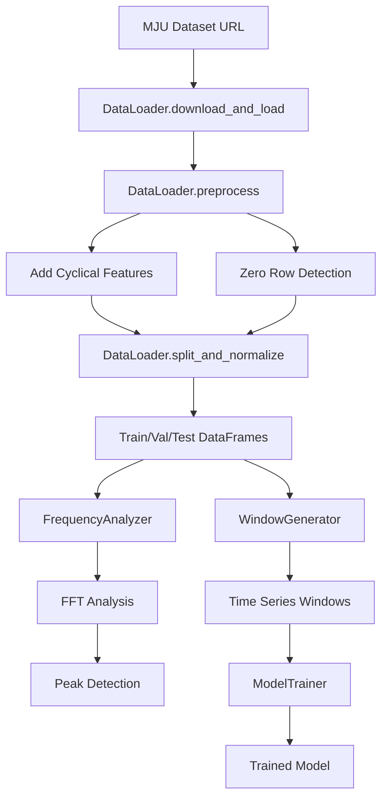

# System Architecture

## Project Structure

```
python-prj/
├── src/                          # Core application code
│   ├── main.py                   # Main execution pipeline
│   ├── data_loader.py            # Data handling and preprocessing
│   ├── frequency_analyzer.py     # FFT-based frequency analysis
│   ├── window_generator.py       # Time series windowing
│   ├── model_trainer.py          # Model training infrastructure
│   └── jupyter_nb/               # Research notebooks
│       ├── lstm01.ipynb          # LSTM model experiments
│       ├── pv-mju-data.ipynb     # MJU dataset analysis
│       └── *.ipynb               # Other analysis notebooks
├── latex/                        # Academic paper documentation
│   ├── PhotovoltaicHA.tex        # Main paper document
│   ├── chapters/                 # Paper sections
│   │   ├── introduction.tex      # Research introduction
│   │   ├── methodology.tex       # Methods and approach
│   │   └── *.tex                 # Other paper sections
│   └── *.bst, *.cls             # LaTeX style files
└── .kilocode/                    # Project configuration
    └── rules/memory-bank/        # Memory bank documentation
```

## Core Components

### 1. Data Pipeline Architecture

#### [`DataLoader`](src/data_loader.py:6)

**Purpose**: Centralized data handling and preprocessing
**Key Methods**:

- [`download_and_load()`](src/data_loader.py:23): Downloads and loads MJU dataset
- [`preprocess()`](src/data_loader.py:32): Adds cyclical time features, detects zero rows
- [`split_and_normalize()`](src/data_loader.py:54): Creates train/val/test splits with normalization

**Data Flow**:

```
Raw CSV.gz → Download → Preprocessing → Feature Engineering → Train/Val/Test Split
```

#### [`FrequencyAnalyzer`](src/frequency_analyzer.py:4)

**Purpose**: FFT-based frequency domain analysis
**Key Methods**:

- [`analyze()`](src/frequency_analyzer.py:35): Performs FFT and identifies peak frequencies
- [`find_peaks_manual()`](src/frequency_analyzer.py:25): Custom peak detection algorithm

**Analysis Pipeline**:

```
Time Series → FFT → Peak Detection → Frequency/Period Identification
```

### 2. Model Training Architecture

#### [`WindowGenerator`](src/window_generator.py:5)

**Purpose**: Time series windowing for supervised learning
**Key Features**:

- Configurable input/label widths and shift parameters
- Automatic dataset creation with TensorFlow's `timeseries_dataset_from_array`
- Built-in visualization capabilities
- Property-based access to train/val/test datasets

**Window Structure**:

```
[Input Window] → [Shift] → [Label Window]
     24h            1h         1h
```

#### [`ModelTrainer`](src/model_trainer.py:3)

**Purpose**: Standardized model training with early stopping
**Features**:

- Early stopping callback with configurable patience
- Standard MSE loss and MAE metrics
- Adam optimizer with default settings

### 3. Main Execution Pipeline

#### [`main.py`](src/main.py:25)

**Current Flow**:

1. Data loading and preprocessing via [`DataLoader`](src/data_loader.py:6)
2. Frequency analysis on 'Current Power' feature
3. Display of top frequency peaks and their periods
4. **Commented out**: Window generation and model training

**Dataset Configuration**:

- **Source**: MJU (Maejo University) PV installation
- **URL**: `https://itsci.mju.ac.th/downloads/watcharin/datasets/pv/`
- **File**: `export_device_1_basic_aggregated_15minutes.csv.gz`
- **Features**: 8 operational and environmental variables

## Design Patterns

### 1. Modular Component Design

Each major functionality is encapsulated in its own class:

- **Separation of Concerns**: Data loading, analysis, windowing, and training are separate
- **Reusability**: Components can be used independently or combined
- **Testability**: Each component can be tested in isolation

### 2. Configuration-Driven Architecture

Key parameters are defined as constants in [`main.py`](src/main.py:15):

```python
DATASET_HOST = 'https://itsci.mju.ac.th/downloads/watcharin/datasets/pv/'
DATASET_FILE = 'export_device_1_basic_aggregated_15minutes.csv.gz'
ALL_COLS = ['Grid Feed In', 'External Energy Supply', ...]
MAX_EPOCHS = 20
```

### 3. Property-Based Dataset Access

[`WindowGenerator`](src/window_generator.py:77) uses Python properties for lazy dataset creation:

- `window.train` → Creates training dataset
- `window.val` → Creates validation dataset
- `window.test` → Creates test dataset

## Data Flow Architecture



## Integration Points

### Current Integration Status

- ✅ **Data → Frequency Analysis**: Working integration
- ❌ **Data → Model Training**: Commented out in main pipeline
- ❌ **Model → Evaluation**: Not implemented
- ❌ **Fault Detection**: Not implemented

### Planned Integration

The architecture supports future integration of:

1. **Multiple Model Types**: LSTM, GRU, Transformer-based models, CNN, and hybrid architectures
2. **Evaluation Framework**: Model comparison and metrics for performance evaluation
3. **Fault Detection**: Anomaly detection using trained models
4. **Optimization Engine**: Energy management recommendations

## Critical Implementation Paths

### 1. Model Training Pipeline

**Current State**: Infrastructure exists but not integrated
**Path**: [`main.py:66-74`](src/main.py:66) contains commented model training code
**Next Steps**: Uncomment and integrate with specific model architectures

### 2. Research Validation Pipeline

**Current State**: Jupyter notebooks contain experimental code
**Path**: [`src/jupyter_nb/lstm01.ipynb`](src/jupyter_nb/lstm01.ipynb) shows LSTM implementation patterns
**Next Steps**: Migrate proven approaches to main codebase

### 3. Academic Documentation

**Current State**: LaTeX structure exists with partial content
**Path**: [`latex/chapters/methodology.tex`](latex/chapters/methodology.tex) needs completion
**Next Steps**: Document implemented methodology and results
