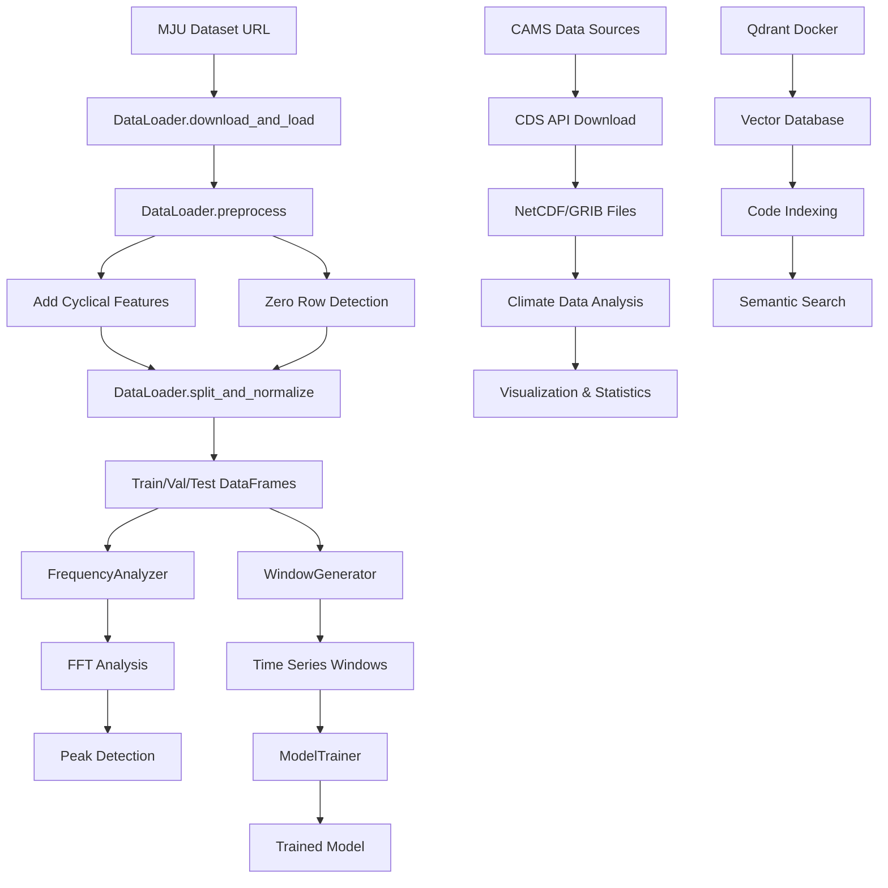

# System Architecture

## Project Structure

```
python-prj/
├── src/                          # Core application code
│   ├── main.py                   # Main execution pipeline
│   ├── data_loader.py            # Data handling and preprocessing
│   ├── frequency_analyzer.py     # FFT-based frequency analysis
│   ├── window_generator.py       # Time series windowing
│   ├── model_trainer.py          # Model training infrastructure
│   ├── adaboost_trainer.py       # AdaBoost regression with checkpointing
│   ├── sanitize_source.py       # Unicode character sanitization script
│   ├── reorganize_project.py     # Project structure reorganization script
│   ├── example_dev_mode.py       # Development mode usage examples
│   ├── setup_indexing.py         # Qdrant vector database setup
│   ├── download-data.py          # CAMS gridded solar radiation data download
│   ├── test-download-data.py     # CAMS global radiative forcing data retrieval
│   ├── Test_CAMS-MSG-HIMAWARI_nc_file.py # Comprehensive CAMS data analysis
│   ├── examine_netcdf.py         # NetCDF file structure analysis
│   ├── examine_grib.py           # GRIB file examination with multiple libraries
│   ├── examine_zip_file.py       # ZIP archive examination and extraction
│   ├── visualize_netcdf.py       # NetCDF data visualization
│   └── jupyter_nb/               # Research notebooks
│       ├── lstm01.ipynb          # LSTM model experiments
│       ├── pv-mju-data.ipynb     # MJU dataset analysis
│       └── *.ipynb               # Other analysis notebooks
├── tests/                        # Test files
│   ├── test_checkpointing.py     # Comprehensive checkpointing tests
│   ├── test_adaboost_trainer.py  # AdaBoost trainer tests
│   └── test_qdrant_integration.py # Vector database integration tests
├── docs/                         # Documentation
│   ├── QDRANT_SETUP_COMPLETE.md  # Vector database setup documentation
│   └── README.md                 # Project documentation
├── latex/                        # Academic paper documentation
│   ├── PhotovoltaicHA.tex        # Main paper document
│   ├── chapters/                 # Paper sections
│   │   ├── introduction.tex      # Research introduction
│   │   ├── methodology.tex       # Methods and approach
│   │   └── *.tex                 # Other paper sections
│   └── *.bst, *.cls             # LaTeX style files
├── docker-compose.yaml           # Qdrant service configuration
├── data_analysis_summary.md      # Climate data analysis summary
├── examine_netcdf.py             # Root-level NetCDF examination script
├── examine_grib.py               # Root-level GRIB examination script
├── examine_binary_file.py        # Binary file format detection
├── extract_zip.py                # ZIP extraction utility
├── visualize_netcdf.py           # Root-level NetCDF visualization
└── .kilocode/                    # Project configuration
    └── rules/memory-bank/        # Memory bank documentation
```

## Core Components

### 1. Data Pipeline Architecture

#### [`DataLoader`](src/data_loader.py:6)

**Purpose**: Centralized data handling and preprocessing
**Key Methods**:

- [`download_and_load()`](src/data_loader.py:23): Downloads and loads MJU dataset
- [`preprocess()`](src/data_loader.py:32): Adds cyclical time features, detects zero rows
- [`split_and_normalize()`](src/data_loader.py:54): Creates train/val/test splits with normalization

**Data Flow**:

```
Raw CSV.gz → Download → Preprocessing → Feature Engineering → Train/Val/Test Split
```

#### [`FrequencyAnalyzer`](src/frequency_analyzer.py:4)

**Purpose**: FFT-based frequency domain analysis
**Key Methods**:

- [`analyze()`](src/frequency_analyzer.py:35): Performs FFT and identifies peak frequencies
- [`find_peaks_manual()`](src/frequency_analyzer.py:25): Custom peak detection algorithm

**Analysis Pipeline**:

```
Time Series → FFT → Peak Detection → Frequency/Period Identification
```

### 2. Climate Data Analysis Architecture

#### NetCDF Data Processing

**Components**:

- [`examine_netcdf.py`](examine_netcdf.py:4): File structure analysis and metadata extraction
- [`src/examine_netcdf.py`](src/examine_netcdf.py:4): Simplified NetCDF examination
- [`visualize_netcdf.py`](visualize_netcdf.py:6): CO2 radiative forcing visualization

**Processing Pipeline**:

```
NetCDF Files → Structure Analysis → Data Extraction → Visualization → Statistical Analysis
```

#### GRIB Data Processing

**Components**:

- [`examine_grib.py`](examine_grib.py:9): Multi-library GRIB file examination
- [`src/examine_grib.py`](src/examine_grib.py:3): Command-line GRIB analysis tool

**Processing Pipeline**:

```
GRIB Files → Format Detection → Multi-Library Analysis → Metadata Extraction
```

#### Data Acquisition Infrastructure

**Components**:

- [`src/download-data.py`](src/download-data.py:1): CAMS gridded solar radiation data
- [`src/test-download-data.py`](src/test-download-data.py:1): CAMS global radiative forcing data
- [`src/Test_CAMS-MSG-HIMAWARI_nc_file.py`](src/Test_CAMS-MSG-HIMAWARI_nc_file.py:1): Comprehensive CAMS analysis

**Data Sources**:

- **CAMS Gridded Solar Radiation**: Global horizontal, direct, and diffuse irradiation
- **CAMS Global Radiative Forcings**: CO2 instantaneous longwave radiative forcing
- **CAMS MSG+HIMAWARI**: High-resolution satellite-based irradiation data

### 3. Model Training Architecture

#### [`WindowGenerator`](src/window_generator.py:5)

**Purpose**: Time series windowing for supervised learning
**Key Features**:

- Configurable input/label widths and shift parameters
- Automatic dataset creation with TensorFlow's `timeseries_dataset_from_array`
- Built-in visualization capabilities
- Property-based access to train/val/test datasets

**Window Structure**:

```
[Input Window] → [Shift] → [Label Window]
     24h            1h         1h
```

#### [`ModelTrainer`](src/model_trainer.py:3)

**Purpose**: Standardized model training with early stopping
**Features**:

- Early stopping callback with configurable patience
- Standard MSE loss and MAE metrics
- Adam optimizer with default settings

#### [`AdaBoostTrainer`](src/adaboost_trainer.py:22)

**Purpose**: AdaBoost regression with cross-validation and checkpointing
**Key Features**:

- Time series cross-validation using TimeSeriesSplit
- Model checkpointing with save/load/restore functionality
- Development mode for faster training and testing
- Best model tracking during cross-validation
- Comprehensive error handling and edge case management

**Checkpointing Architecture**:

```
Training → Cross-Validation → Best Model Selection → Save Checkpoint
                ↓
Load Checkpoint → Restore Best Model → Skip Training (Optional)
```

### 4. Vector Database Architecture

#### Qdrant Integration

**Components**:

- [`docker-compose.yaml`](docker-compose.yaml:1): Service configuration
- [`src/setup_indexing.py`](src/setup_indexing.py:1): Collection initialization
- [`docs/QDRANT_SETUP_COMPLETE.md`](docs/QDRANT_SETUP_COMPLETE.md:1): Setup documentation

**Architecture**:

```
Docker Container → Qdrant Service → HTTP API → Collection Management → Vector Storage
```

**Configuration**:

- **Collection**: `python_pv_codebase`
- **Vector Size**: 1536 (text-embedding-3-small compatible)
- **Distance Metric**: Cosine similarity
- **Ports**: 6333 (HTTP), 6334 (gRPC)

### 5. Main Execution Pipeline

#### [`main.py`](src/main.py:25)

**Current Flow**:

1. Data loading and preprocessing via [`DataLoader`](src/data_loader.py:6)
2. Frequency analysis on 'Current Power' feature
3. Display of top frequency peaks and their periods
4. **Commented out**: Window generation and model training

**Dataset Configuration**:

- **Source**: MJU (Maejo University) PV installation
- **URL**: `https://itsci.mju.ac.th/downloads/watcharin/datasets/pv/`
- **File**: `export_device_1_basic_aggregated_15minutes.csv.gz`
- **Features**: 8 operational and environmental variables

## Design Patterns

### 1. Modular Component Design

Each major functionality is encapsulated in its own class:

- **Separation of Concerns**: Data loading, analysis, windowing, and training are separate
- **Reusability**: Components can be used independently or combined
- **Testability**: Each component can be tested in isolation

### 2. Multi-Format Data Support

**File Format Handlers**:

- **NetCDF**: netCDF4 library with comprehensive metadata extraction
- **GRIB**: Multiple library support (pygrib, cfgrib/xarray)
- **ZIP**: Standard zipfile library with content analysis
- **Binary**: Custom binary file format detection

### 3. Configuration-Driven Architecture

Key parameters are defined as constants in [`main.py`](src/main.py:15):

```python
DATASET_HOST = 'https://itsci.mju.ac.th/downloads/watcharin/datasets/pv/'
DATASET_FILE = 'export_device_1_basic_aggregated_15minutes.csv.gz'
ALL_COLS = ['Grid Feed In', 'External Energy Supply', ...]
MAX_EPOCHS = 20
```

### 4. Property-Based Dataset Access

[`WindowGenerator`](src/window_generator.py:77) uses Python properties for lazy dataset creation:

- `window.train` → Creates training dataset
- `window.val` → Creates validation dataset
- `window.test` → Creates test dataset

## Data Flow Architecture



## Integration Points

### Current Integration Status

- ✅ **Data → Frequency Analysis**: Working integration
- ✅ **Climate Data → Visualization**: Working integration
- ✅ **Vector Database**: Operational setup complete
- ❌ **Data → Model Training**: Commented out in main pipeline
- ❌ **Climate Data → PV Prediction**: Not yet integrated
- ❌ **Multi-Modal Training**: Not implemented
- ❌ **Model → Evaluation**: Not implemented
- ❌ **Semantic Code Search**: Collection created but not indexed

### Planned Integration

The architecture supports future integration of:

1. **Multi-Modal Data Fusion**: Combining PV operational data with climate datasets
2. **Climate-Enhanced Models**: LSTM/CNN architectures incorporating weather data
3. **Semantic Code Search**: Full codebase indexing in Qdrant
4. **Evaluation Framework**: Model comparison and metrics for performance evaluation
5. **Fault Detection**: Anomaly detection using trained models
6. **Optimization Engine**: Energy management recommendations

## Critical Implementation Paths

### 1. Climate Data Integration Pipeline

**Current State**: Analysis tools exist but not integrated with PV prediction
**Components**: NetCDF/GRIB processors, CAMS data downloaders, visualization tools
**Next Steps**: Create unified preprocessing pipeline for multi-modal data

### 2. Model Training Pipeline

**Current State**: Infrastructure exists but not integrated
**Path**: [`main.py:66-74`](src/main.py:66) contains commented model training code
**Next Steps**: Uncomment and integrate with specific model architectures

### 3. Vector Database Utilization

**Current State**: Qdrant service running, collection created
**Path**: [`src/setup_indexing.py`](src/setup_indexing.py:1) initializes collection
**Next Steps**: Implement codebase indexing and semantic search functionality

### 4. Research Validation Pipeline

**Current State**: Jupyter notebooks contain experimental code
**Path**: [`src/jupyter_nb/lstm01.ipynb`](src/jupyter_nb/lstm01.ipynb) shows LSTM implementation patterns
**Next Steps**: Migrate proven approaches to main codebase

### 5. Academic Documentation

**Current State**: LaTeX structure exists with partial content
**Path**: [`latex/chapters/methodology.tex`](latex/chapters/methodology.tex) needs completion
**Next Steps**: Document implemented methodology and results including climate data integration

## Data Processing Workflows

### Climate Data Workflow

```
CDS API → Download → Format Detection → Analysis → Visualization → Integration
```

### PV Data Workflow

```
MJU Source → Download → Preprocessing → Feature Engineering → Model Training
```

### Multi-Modal Workflow (Planned)

```
PV Data + Climate Data → Spatial/Temporal Alignment → Feature Fusion → Enhanced Models
```
